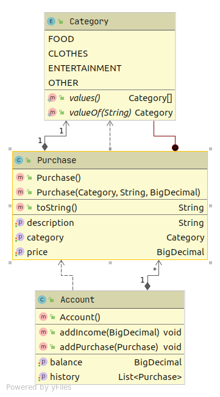
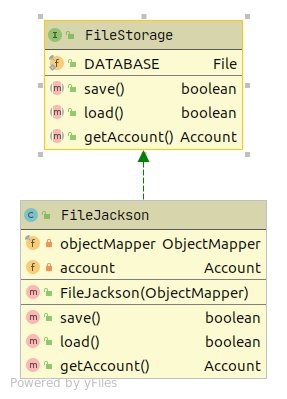
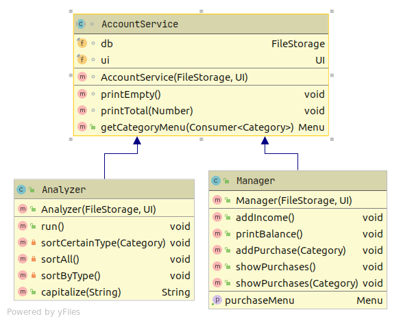

# Budget Manager
## About

Not to sound overly serious, but it’s very important to manage your budget. This implies analyzing your expenses and estimating the income, which sometimes may be difficult to do yourself. Luckily, technology is there to assist: you can create your own personal budget manager program that counts the ins and outs and helps control the finances.
## Learning outcomes

You will create a very applicable product, and in the meanwhile also get acquainted with the basic concepts of programming in Java. You will deal with the widest variety of tools: work with strings, perform mathematical calculations and sort the data.

## UML Diagrams

### Package budget.domain

### Package budget.repository

### Packgage budget.services

